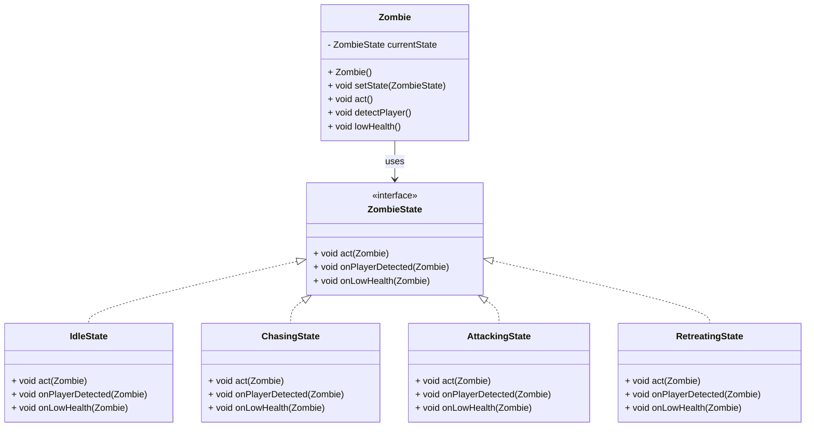

## Zadatak za vežbu

Implementirati klase koje definišu stanja korišćenjem state paterna za stanja zombija u Minecraft igrici.

Zombi treba da ima tri metode:
1. `void act(Zombie zombie)` - treba da izvrši akciju u trenutnom stanju
2. `void onPlayerDetected(Zombie zombie)` - izvršiti promenu stanja ukoliko je moguće kada zombi vidi igrača
3. `void onLowHealth(Zombie zombie)` - izvršiti promenu stanja ukoliko je moguće kada zombi ima malo života

