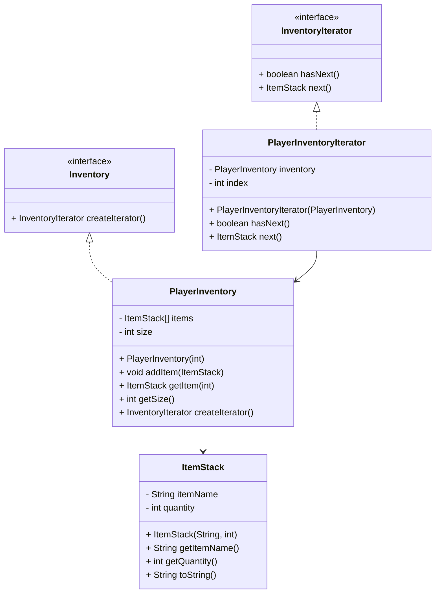

## Zadatak za vežbu

Implementirati klasu koja predstavlja stack blokova u inventaru (inventory).

Potom implementirati interfejs koji zahteva implementiranje sledećih metoda:
1. `boolean hasNext()` - vraća informaciju da li postoji još elemenata u iteratoru
2. `ItemStack next()` - vraća sledeći item stack u inventaru

Implementirati klasu `PlayerInventory` koja pravi inventar i sadrži bar jenu metodu, `InventoryIterator createIterator()` koja vaća objekat koji implementira interfejs `InventoryIterator`.

Implementirati klasu `PlayerInventoryIterator` koja implementira interfejs `InventoryIterator` koji sadrži instancu klase `PlayerInventory` i može da iterira po tom inventaru.

Testirati implementirane klase u programu.

### Diagram koji može biti od pomoći

