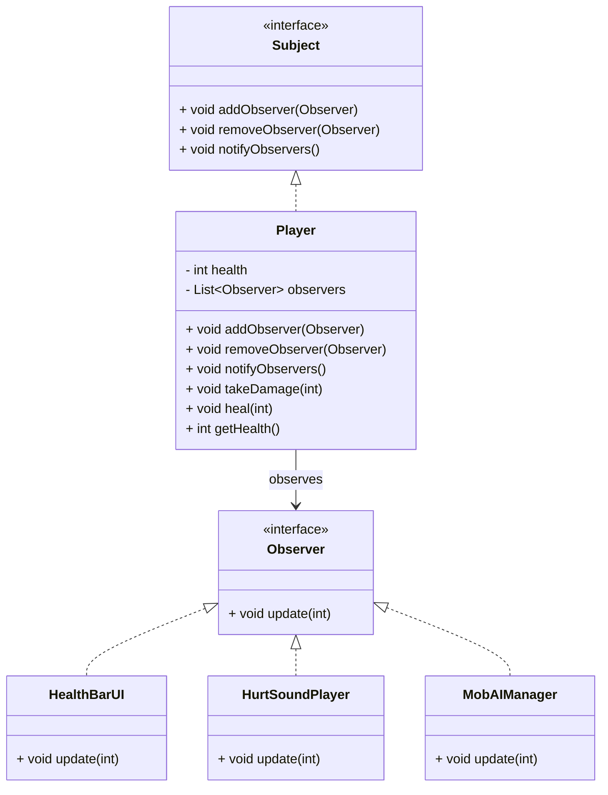

## Zadatak za vežbu

```mermaid
classDiagram

    class Subject {
        <<interface>>
        + void addObserver(Observer)
        + void removeObserver(Observer)
        + void notifyObservers()
    }

    class Observer {
        <<interface>>
        + void update(int)
    }

    class Player {
        - int health
        - List~Observer~ observers
        + void addObserver(Observer)
        + void removeObserver(Observer)
        + void notifyObservers()
        + void takeDamage(int)
        + void heal(int)
        + int getHealth()
    }

    class HealthBarUI {
        + void update(int)
    }

    class HurtSoundPlayer {
        + void update(int)
    }

    class MobAIManager {
        + void update(int)
    }

    Subject <|.. Player
    Observer <|.. HealthBarUI
    Observer <|.. HurtSoundPlayer
    Observer <|.. MobAIManager
    Player --> Observer : observes
```
