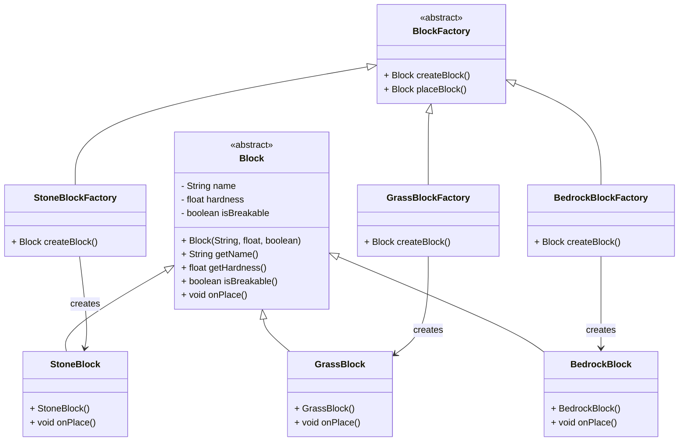

## Zadatak za vežbu

```mermaid
classDiagram

    class Block {
        <<abstract>>
        - String name
        - float hardness
        - boolean isBreakable
        + Block(String, float, boolean)
        + String getName()
        + float getHardness()
        + boolean isBreakable()
        + void onPlace()
    }

    class StoneBlock {
        + StoneBlock()
        + void onPlace()
    }

    class GrassBlock {
        + GrassBlock()
        + void onPlace()
    }

    class BedrockBlock {
        + BedrockBlock()
        + void onPlace()
    }

    class BlockFactory {
        <<abstract>>
        + Block createBlock()
        + Block placeBlock()
    }

    class StoneBlockFactory {
        + Block createBlock()
    }

    class GrassBlockFactory {
        + Block createBlock()
    }

    class BedrockBlockFactory {
        + Block createBlock()
    }

    Block <|-- StoneBlock
    Block <|-- GrassBlock
    Block <|-- BedrockBlock

    BlockFactory <|-- StoneBlockFactory
    BlockFactory <|-- GrassBlockFactory
    BlockFactory <|-- BedrockBlockFactory
    StoneBlockFactory --> StoneBlock : creates
    GrassBlockFactory --> GrassBlock : creates
    BedrockBlockFactory --> BedrockBlock : creates
```
